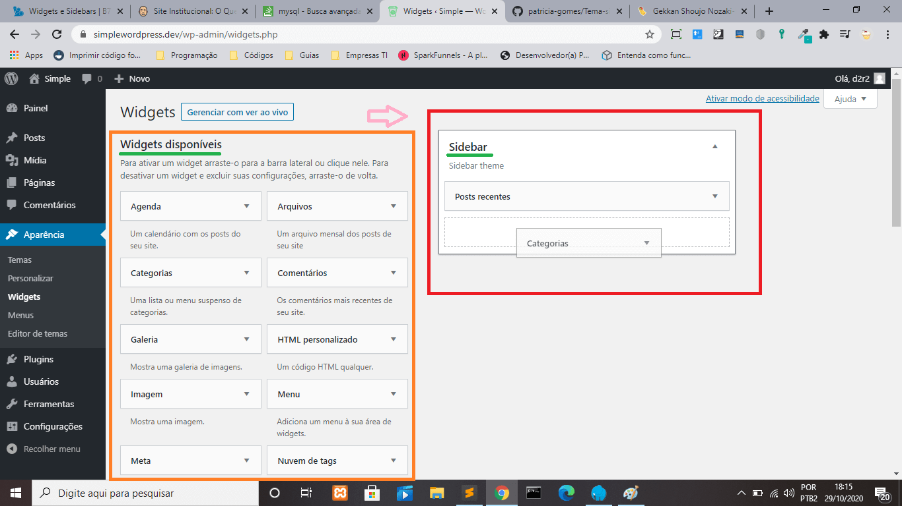

# SimpleWordpress

Utilizando o wordpress para desenvolver um pequeno blog com tema próprio com uma listagem de artigos fictícios que serão armazenado no banco MySQL pelo Wordpress. 
Esse pequeno projeto tem paginação, leia mais, listagem de artigos em wordpress, exibe a quantidade de comentários. No sidebar tem uma listagem de  posts recentes

## Utilizando Wordpress no Laragon

Depois de baixar o [laragon](https://laragon.org/download/index.html) 
<strong>1-</strong> Abra o painel do laragon, clique em 'Menu' e vai até 'Criar rapidamente um website' e escolha 'wordpress' 
<strong>2-</strong> Vai abrir uma janela perguntando o nome do projeto wordpress: digite o nome do seu projeto 
<strong>3-</strong> Espere carregar e então clique em 'visit site' e vai abrir uma aba no navegador do projeto que você acabou de criar. 
(Continua abaixo)

## Configurando o Wordpress

<strong>4-</strong> Você será redirecionado para uma url do tipo: `https://nomedoseuprojeto.dev/wp-admin/install.php` escolha a linguagem e clique em 'continuar' 
<strong>5-</strong> O redirecionamento vai trazer uma página de bem vindo(a) que contém um formulário para você preencher com informação necessária. 
<strong>6-</strong> No campo 'Visibilidade nos mecanismos de busca' marque o checkbox se quise que os motores de busca não encontre o seu projeto e exiba o seu projeto wordpress nos bucadores (google, bing, yahoo!). Guarde bem seu nome de usuário e senha você vai precisar deles para fazer login no wordpress. 
<strong>7-</strong> Depois que preencher todos os campos do formulário vai aparecer uma tela com a mensagem 'Sucesso!' o wordpress foi instalado com sucesso. Agora clicque em 'Acessar' para acessar o painel de controle do wordpress. 
<strong>8-</strong> Atualize tudo que o wordpress te notificar para atualizar no painel de controle. 
<strong>9-</strong> E para finalizar o wordpress `5.5.1` cria automaticamente o banco de dados com o nome que você forneceu no formuláro de cadastro. Se você quiser alterar o host do banco de dados ou a senha é só ir no arquivo <strong>wp-config.php</strong>. 

## Criar Tema

<strong>1-</strong> Para desenvolver um tema novo abra a pasta do projeto wordpress navegue até 'wp-content/themes'. Dentro da pasta 'themes' crie uma pasta com o nome do seu tema. 
<strong>2-</strong> Para esse tema ser reconhecido pelo wordpress precisa ter alguns arquivos dentro da pasta que você acabou de criar. Precisa criar os arquivos <strong>style.css</strong> e <strong>index.php</strong>. 
<strong>3-</strong> Crie um arquivo style.css dentro da pasta principal do seu <strong>tema</strong>. 
  
<strong>4-</strong> E copie o conteúdo comentado no style.css que tem nos outros temas que vem junto com wordpress como o 'twentynineteen' e altere alguns parâmetros: <strong>Theme Name</strong>, <strong>Theme URI</strong>, <strong>Author</strong>, <strong>Description</strong>, <strong>Text Domain</strong>, <strong>Tags</strong> 
 
<strong>5-</strong> Crie o arquivo index.php e salve dentro da pasta principal do seu <strong>tema</strong>. 
  
<strong>6-</strong> Depois de ter criado esses dois arquivos o wordpress já reconhece como tema, então pode ir até o painel de controle no menu lateral e clique em 'Aparência' -> 'Temas'. Vai aparecer o nome do seu tema como mostra a imagem abaixo. 
  
<strong>7-</strong> Agora vamos aprender a como colocar uma imagem no nosso tema. Você escolhe uma imagem que vai representar o seu tema e salve ela na pasta principal do tema com o nome 'screenshot.png' 
  
<strong>8-</strong> Só ir de novo no painel de controle no menu lateral e clicar em 'Aparência' -> 'Temas' e já vai aparecer o seu tema com a imagem. 
  

## Adicionando a logo

Essa imagem abaixo é a logo do blog que foi inserida através do painel de controle no menu lateral em 'Aparência' -> 'Personalizar' -> 'Identidade do site' e clique em 'Selecionar logo'

  

## Adicionando o ícone

O ícone é aquela imagem que tem na aba do navegador. No painel de controle no menu lateral em 'Aparência' -> 'Personalizar' -> 'Identidade do site' e clique em 'Selecionar ícone do site'.

## Adicionando a Sidebar

Antes de tudo temos de ativar as widgets que são: categorias, posts recentes, nuvem de tags etc. Só depois de ativados é que os widgets vão aparecer no menu lateral do painel wordpress. Em wp-content/themes/simple/functions.php esta um dos código para ativar. E em wp-content/themes/simple/include/helper.php esta a função <strong>ps_widgets()</strong> que faz a ativação do sidebar no wordpress.

Para adicionar os widgets ao sidebar vai até Aparência -> Widgets e arraste os widgets disponíveis de sua escolha para o Sidebar.

